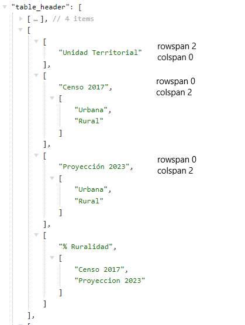
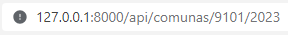
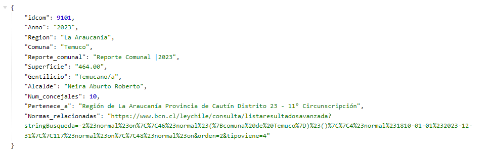
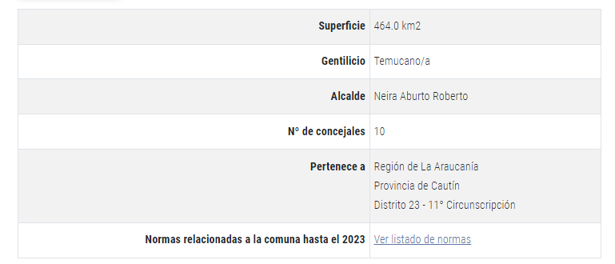
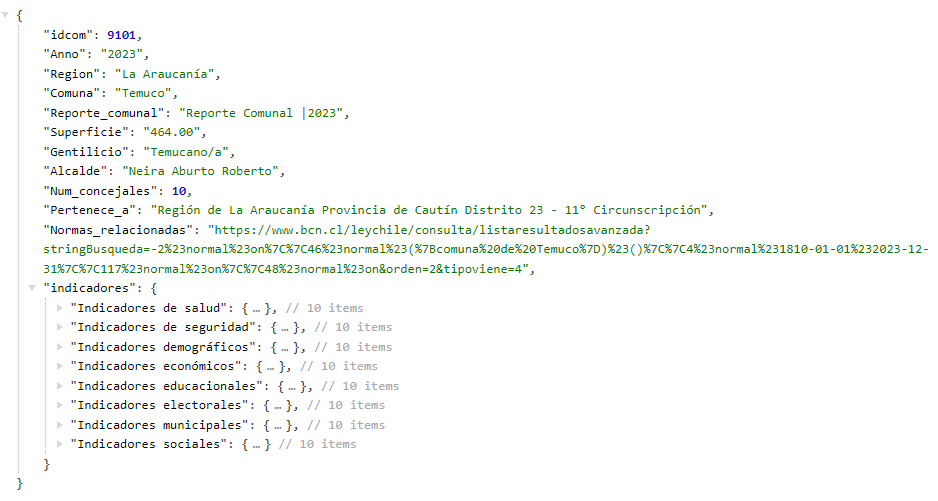
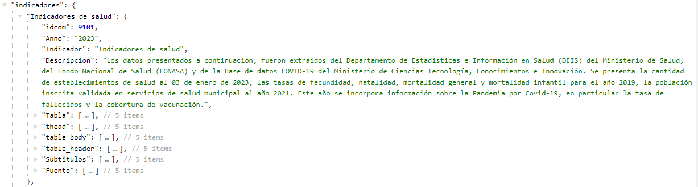

# Web Scraping: Datos BCN

## Instalación y Configuración

Para utilizar este proyecto, necesitarás instalar algunas librerías en Python 3. A continuación se detalla cómo instalar cada una de ellas:

1. **Pandas**: Una librería de Python para manipulación y análisis de datos.
2. **Requests**: Permite enviar solicitudes HTTP en Python.
3. **BeautifulSoup**: Utilizada para el análisis de documentos HTML y XML.
4. **MySQL Connector**: Una librería para conectar Python con una base de datos MySQL.

```
pip install pandas requests beautifulsoup4 mysql-connector-python
```


## Cómo Usar el Proyecto

Para ejecutar el proyecto, sigue estos pasos:

1. Ejecuta todo el código presente en el notebook main.ipynb. Esto iniciará el proceso de web scraping y almacenará los datos en tu base de datos MySQL.

2. Rellena la información presente en la primera celda.

```python
# Datos de conexión a MySQL
host = "localhost"
user = "root"
password = ""
database = "example"

# Nombre de la tabla para guardar los datos de las comunas
tabla_comunas = 'datoscomuna'
# Por defecto la tabla de "Indicadores" tendrá ese nombre.
```
## Describir cada una de las tablas
### Descripción de Campos de la Tabla `tabla_comunas`

#### `idcom` 
- **Tipo de Dato:** INT
- **Descripción:** Representa el código unico territorial (CUT). Es un número entero.

#### `Anno`
- **Tipo de Dato:** YEAR
- **Descripción:** Año al que corresponden los datos de la comuna. Utiliza el formato de año de MySQL.

#### `Region`
- **Tipo de Dato:** VARCHAR(255)
- **Descripción:** Nombre de la región a la que pertenece la comuna. Es un campo de texto con una longitud máxima de 255 caracteres.

#### `Comuna`
- **Tipo de Dato:** VARCHAR(255)
- **Descripción:** Nombre de la comuna. Campo de texto con un máximo de 255 caracteres.

#### `Reporte_comunal`
- **Tipo de Dato:** VARCHAR(255)
- **Descripción:** Información detallada o reporte sobre la comuna. Puede incluir texto extenso.

#### `Superficie`
- **Tipo de Dato:** DECIMAL(10,2)
- **Descripción:** Superficie de la comuna expresada en kilómetros cuadrados u otra unidad de medida. Es un número decimal con hasta 10 dígitos en total y 2 decimales.

#### `Gentilicio`
- **Tipo de Dato:** VARCHAR(255)
- **Descripción:** Gentilicio de los habitantes de la comuna. Es un campo de texto que admite hasta 255 caracteres.

#### `Alcalde`
- **Tipo de Dato:** VARCHAR(255)
- **Descripción:** Nombre del alcalde de la comuna. Campo de texto con un límite de 255 caracteres.

#### `Num_concejales`
- **Tipo de Dato:** INT
- **Descripción:** Número de concejales de la comuna. Es un número entero.

#### `Pertenece_a`
- **Tipo de Dato:** VARCHAR(255)
- **Descripción:** Indica a qué entidad superior (como una provincia o un departamento) pertenece la comuna. Texto con un máximo de 255 caracteres.

#### `Normas_relacionadas`
- **Tipo de Dato:** TEXT
- **Descripción:** Texto que describe las normas, leyes o regulaciones relevantes para la comuna. Admite una cantidad extensa de texto.

#### Llave Primaria
- **Campos:** `idcom`, `Anno`
- **Descripción:** La combinación de `idcom` y `Anno` se utiliza como llave primaria para garantizar la unicidad de cada registro.


## Descripción de la Tabla `indicadores`

#### `idcom`
- **Tipo de Dato:** INT
- **Descripción:** Representa el código unico territorial (CUT),  correspondiente al campo `idcom` en la tabla `{tabla_comunas}`. Es un número entero.

#### `Anno`
- **Tipo de Dato:** YEAR
- **Descripción:** Año al que corresponden los datos. Coincide con el campo `Anno` en la tabla `{tabla_comunas}` y utiliza el formato de año de MySQL.

#### `Indicador`
- **Tipo de Dato:** VARCHAR(255)
- **Descripción:** Nombre o identificador del indicador específico relacionado con la comuna para ese año. Campo de texto con una longitud máxima de 255 caracteres.

#### `Descripcion`
- **Tipo de Dato:** TEXT
- **Descripción:** Descripción detallada del indicador. Puede incluir texto extenso.

#### `Tabla`
- **Tipo de Dato:** TEXT
- **Descripción:** Contiene toda la información de las tablas en formato HTML.

#### `thead`
- **Tipo de Dato:** TEXT
- **Descripción:** Define el encabezado de una tabla relacionada con el indicador.  Contiene toda la información en HTML.

#### `table_body`
- **Tipo de Dato:** TEXT
- **Descripción:** Contenido del cuerpo de una tabla relacionada con el indicador en arreglos. 

#### `table_header`
- **Tipo de Dato:** TEXT
- **Descripción:** Encabezado específico de la tabla, posiblemente incluyendo títulos o etiquetas HTML. Para este caso, la información se encuentra almacenada en arreglos según su rowspan y colspan asociado. Por defecto, el primer valor del arreglo tendra un rowspan = 2 y colspan = '', mientras que los demas al tener un rowspan = '' y colspan = valor_num tendran subarreglos que representaran los conjuntos de informacion que proporciona los tr y th. 


#### `Subtitulos`
- **Tipo de Dato:** TEXT
- **Descripción:** Subtítulos o texto adicional que proporciona más contexto o información sobre el indicador.

#### `Fuente`
- **Tipo de Dato:** TEXT
- **Descripción:** Fuente de la información del indicador, puede incluir referencias textuales o enlaces.

#### Llave Primaria
- **Campos:** `idcom`, `Anno`, `Indicador`
- **Descripción:** La combinación de `idcom`, `Anno` y `Indicador` se utiliza como llave primaria para garantizar la unicidad de cada registro.

#### Clave Foránea
- **Referencia:** `(idcom, Anno)` en `{tabla_comunas}`
- **Descripción:** Establece una relación de dependencia con la tabla `{tabla_comunas}`, usando los campos `idcom` y `Anno` como referencia.


## Implementación y ejemplo de uso

La carpeta `code-laravel` contiene tres subcarpetas `controller`, `models` y `routes`. En estas carpetas se encuentran los codigo asociados que generan la API.

#### 1) Consulta 1
La primera ruta permite obtener la información de una comuna y año en especifico.
Por ejemplo, para la comuna con CUT 9101 (Temuco) y el año 2023, se obtiene la siguiente información.




Esta informacion corresponde a la siguiente tabla https://www.bcn.cl/siit/reportescomunales/comunas_v.html?anno=2023&idcom=9101: 




#### 2) Consulta 2
La segunda ruta permite obtener la información de una comuna y año en especifico pero agregando la informacion de sus indicadores. Para ello es necesario agregar en la url la palabra indicadores. Por ejemplo




Cada indicador que aparece en la imagen anterior contiene información, por ejemplo: 




## Problemas